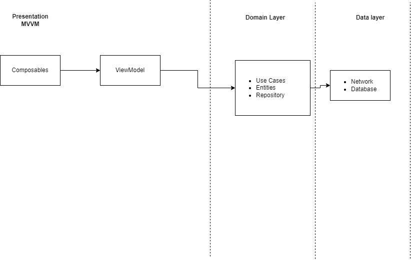

# Architecture Components

## How it looks

    

  

## Architecture  

There are three main layers

Data: module responsible for Network and Database

Presentation: this module is responsible for the view using MVVM with jetpack composables and view models

Domain: module responsible for Use Cases, entities, Repository

## Troubleshooting
add on local.properties yourt TMDB Api v4 key as: 
TMDB_API_KEY= <YOUR_API_KEY>
  
## API
This project implements TMDB's API. More about in:
https://www.themoviedb.org/

  
## Libraries Used :

* [Jetpack Compose](https://developer.android.com/jetpack/compose/tutorial)

* [Materials 3](https://developer.android.com/jetpack/androidx/releases/compose-material3)

* [Navigation Component](https://developer.android.com/guide/navigation/navigation-getting-started)

* [Animated Navigation](https://google.github.io/accompanist/navigation-animation/)

* [ViewModel](https://developer.android.com/topic/libraries/architecture/viewmodel?gclid=Cj0KCQiA4feBBhC9ARIsABp_nbVSzmSdBQuAKP2WhE9fTRDmz2u67AtgL7wFOrs5kgcNKuqHWPbA3mEaAsSJEALw_wcB&gclsrc=aw.ds)

* [Flow](https://developer.android.com/kotlin/coroutines/additional-resources)

* [Retrofit2](https://square.github.io/retrofit/)

* [Coroutines](https://developer.android.com/kotlin/coroutines)

* [Mockk](https://github.com/mockk/mockk)

* [Kluent](https://github.com/MarkusAmshove/Kluent)

* [RoboElectric](https://github.com/robolectric/robolectric)

* [Gradle - DSL ](https://docs.gradle.org/current/userguide/kotlin_dsl.html)

* [Leak Canary](https://github.com/square/leakcanary)

* [Dagger Hilt](https://mvnrepository.com/artifact/com.google.dagger/hilt-android)

* [Room](https://developer.android.com/training/data-storage/room)

* [Coil](https://coil-kt.github.io/coil/compose/) 

## More About (QUESTIONS)

 1. The single responsibility principle consist in that every class, module, or function in a program should have one responsibility/purpose in a program. As a commonly used definition, "every class should have only one reason to change".
 
 2. For me the main characteristics of a clean code is that it is easy to read,easy to test and easy to maintain the clean code always used to have a high cohesion and low coupling.
 
 3. I did not make the filter of recommended movies because it is not a clear point and there are many ways to solve and it was not understandable to me that it was expected from the ui as I could leave a filter for the language with the List of ISO 639-1 codes showing a list with the ISO language name and depending on picked filter the list already obtained or make the TMDB query, for the year you could make an input of a valid year and also filter on the list obtained or a new request to TMDB

## APK VERSION TO INSTALL ON DEVICES

* [APK](https://github.com/andresarangopro/eMovie/blob/master/gitFiles/app-debug.apk) 
